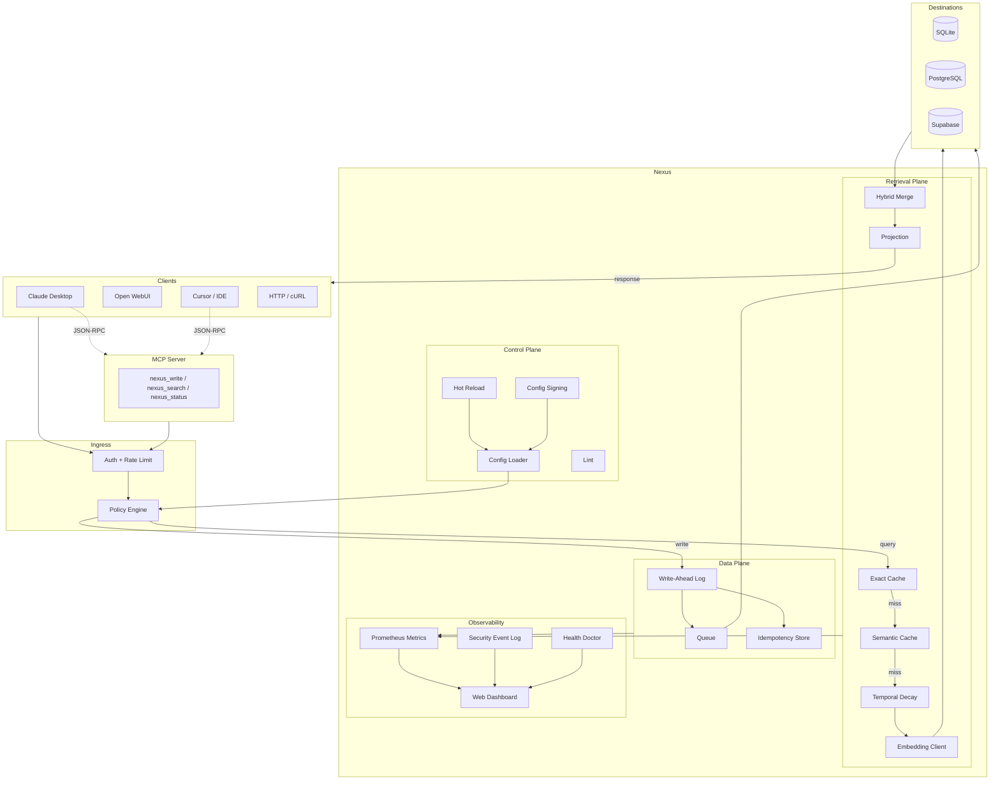

# BubbleFish Nexus

**Gateway-first AI memory daemon.** Sits between AI clients and memory databases, providing crash-safe, policy-aware, retrieval-optimized memory management.

> v0.1.0 (pre-1.0, API subject to change)

## Quick Start (Simple Mode)

```bash
# Install with zero-friction defaults (SQLite, localhost, single API key)
bubblefish install --mode simple

# Start the daemon
bubblefish start
```

That's it. Nexus is now listening on `127.0.0.1:8080` with MCP on `:8082` and the web dashboard on `:8081`.

## Architecture



### Write Path

1. Client sends `POST /write` with payload
2. Auth middleware validates API key (constant-time compare) or JWT
3. Policy engine checks source permissions, allowed destinations, field visibility
4. WAL writes entry with CRC32 checksum (+ optional HMAC/encryption), fsyncs
5. Idempotency store registers the key
6. Non-blocking queue enqueues for async delivery
7. Worker delivers to destination (SQLite/PostgreSQL/Supabase)

### Query Path (6-Stage Retrieval Cascade)

| Stage | Component | Description |
|-------|-----------|-------------|
| 0 | Policy | Auth check, permission validation |
| 1 | Exact Cache | SHA256-keyed LRU with watermark invalidation |
| 2 | Semantic Cache | Embedding similarity (configurable threshold) |
| 3 | Temporal Decay | Exponential or step-mode time scoring |
| 4 | Embedding + DB | Vector similarity + structured query |
| 5 | Projection | Field allowlist, metadata stripping, pagination |

Retrieval profiles (`fast`, `balanced`, `deep`) control which stages run per source.

## Features

| Feature | Description |
|---------|-------------|
| 6-Stage Retrieval Cascade | Policy, exact cache, semantic cache, structured, semantic, hybrid merge with temporal decay and projection |
| Retrieval Profiles | `fast`, `balanced`, `deep` with per-source stage toggles |
| Tiered Temporal Decay | Per-destination/collection decay, exponential and step modes |
| MCP Server | `nexus_write`, `nexus_search`, `nexus_status` for Claude Desktop and Cursor |
| WAL CRC32 Checksums | 4-byte CRC32 on every entry |
| WAL HMAC Integrity | Optional HMAC-SHA256 for tamper detection |
| WAL Encryption | Optional AES-256-GCM with per-entry nonce |
| Config Signing | `bubblefish sign-config` for signed-mode deployments |
| Zero-Dep LRU Cache | Go generics, `map` + `container/list`, no external dependencies |
| Constant-Time Auth | `subtle.ConstantTimeCompare` for all token validation |
| Admin vs Data Token Separation | Wrong token class returns 401 |
| Provenance Fields | `actor_type` (user/agent/system) + `actor_id` on every write |
| Non-Blocking Queue | `select`-based enqueue, `sync.Once` drain |
| Simple Mode Install | `bubblefish install --mode simple` for zero-friction setup |
| Install Profiles | Open WebUI, PostgreSQL, OpenBrain starter configs |
| `bubblefish dev` | Daemon with debug logging and auto-reload |
| Backup and Restore | `bubblefish backup create` / `bubblefish backup restore` |
| Config Lint | `bubblefish lint` for dangerous config detection |
| Consistency Assertions | Background WAL-to-destination consistency checks |
| WAL Health Watchdog | Background disk/permissions/latency monitoring |
| `bubblefish bench` | Throughput, latency, and retrieval evaluation benchmarks |
| Reliability Demo | `bubblefish demo` — golden crash-recovery scenario |
| Structured Security Events | Dedicated security event log for SIEM integration |
| Security Metrics | Auth failures, policy denials, rate limits, admin calls |
| Blessed Integration Configs | Pre-built templates for Claude, Open WebUI, Perplexity |
| Reference Architectures | Dev laptop, home lab, air-gapped deployment docs |
| TLS/mTLS Support | Optional TLS with configurable cert, key, client CA |
| Trusted Proxies | CIDR allowlist with forwarded header parsing |
| Event Sink (Webhooks) | Optional async webhook notifications from WAL |
| Live Pipeline Visualization | Lossy event channel, never blocks hot paths |
| Security Tab | Dashboard tab with source policies and auth failure history |
| Debug Stages | Optional `_nexus.debug` with admin auth |
| System Tray | Windows tray icon with status and dashboard launch |

## CLI Commands

```
bubblefish install      Create config directory and initial configuration
bubblefish start        Start daemon + MCP + dashboard + tray
bubblefish dev          Start daemon with debug logging and auto-reload
bubblefish build        Compile policies and validate configuration
bubblefish lint         Check configuration for dangerous or suboptimal settings
bubblefish mcp test     Start MCP server and verify nexus_status responds
bubblefish backup       Create or restore a backup of config, WAL, and database
bubblefish bench        Throughput, latency, and retrieval evaluation benchmarks
bubblefish demo         Reliability demo: crash-recovery with 50 memories
bubblefish sign-config  Sign compiled config files for signed-mode deployments
bubblefish version      Print version string
```

## Crash-Recovery Demo

BubbleFish Nexus is built for durability. The crash demo proves it:

```bash
# Start the daemon
bubblefish start &

# Run the reliability demo — writes 50 memories, simulates crash, verifies recovery
bubblefish demo --api-key $NEXUS_API_KEY --admin-key $NEXUS_ADMIN_KEY
```

The demo writes 50 memories through the full pipeline, verifies WAL durability through a simulated crash, and confirms every memory survives recovery. Results are visible in both the CLI and the web dashboard.

## MCP Integration

BubbleFish Nexus exposes an MCP server (JSON-RPC 2.0, protocol version `2024-11-05`) for native integration with Claude Desktop and Cursor.

**Tools available via MCP:**
- `nexus_write` — store a memory
- `nexus_search` — query memories with full retrieval cascade
- `nexus_status` — daemon health and metrics

See `examples/blessed/claude-desktop-mcp.toml` for a ready-to-use configuration.

## Configuration

Config lives in `~/.bubblefish/Nexus/`. Key files:

```
~/.bubblefish/Nexus/
  daemon.toml            # Main daemon config
  sources/*.toml         # Per-source auth and policy
  destinations/*.toml    # Database connection configs
  compiled/*.json        # Compiled policies (bubblefish build)
  compiled/*.sig         # Config signatures (bubblefish sign-config)
```

Secrets are never stored in plain text — use `env:VARIABLE_NAME` or `file:/path/to/secret` references.

Source configs support hot reload without restart. Destination changes require restart.

## Blessed Configs

Pre-built starter configurations in `examples/blessed/`:

| File | Use Case |
|------|----------|
| `claude-code-http.toml` | Claude Code via direct HTTP |
| `claude-desktop-mcp.toml` | Claude Desktop via native MCP |
| `open-webui.toml` | Open WebUI integration |
| `perplexity.toml` | Perplexity integration |

## Reference Architectures

- [Dev Laptop](Docs/dev-laptop.md) — local development with SQLite
- [Home Lab](Docs/home-lab.md) — multi-client with PostgreSQL
- [Air-Gapped](Docs/air-gapped.md) — offline deployment with local embeddings

## Known Limitations

See [KNOWN_LIMITATIONS.md](KNOWN_LIMITATIONS.md) for current limitations including the Go 1.26.1 race detector linker bug, SQLite write serialization, and in-memory cache behavior.

## OAuth 2.1 Support

BubbleFish Nexus v0.1.3 includes an OAuth 2.1 authorization server for
MCP clients that require OAuth discovery (ChatGPT connectors, Claude Web
UI custom connectors, etc.). OAuth is **disabled by default**. Clients
that support Bearer token auth (Claude Desktop, Perplexity Comet, Open
WebUI, Cursor) continue to use the static `bfn_mcp_` key path with zero
configuration changes.

See [docs/OAUTH_KNOWN_LIMITATIONS.md](docs/OAUTH_KNOWN_LIMITATIONS.md) for
the current scope and limitations of the OAuth implementation.

## License

[GNU Affero General Public License v3.0](LICENSE)
